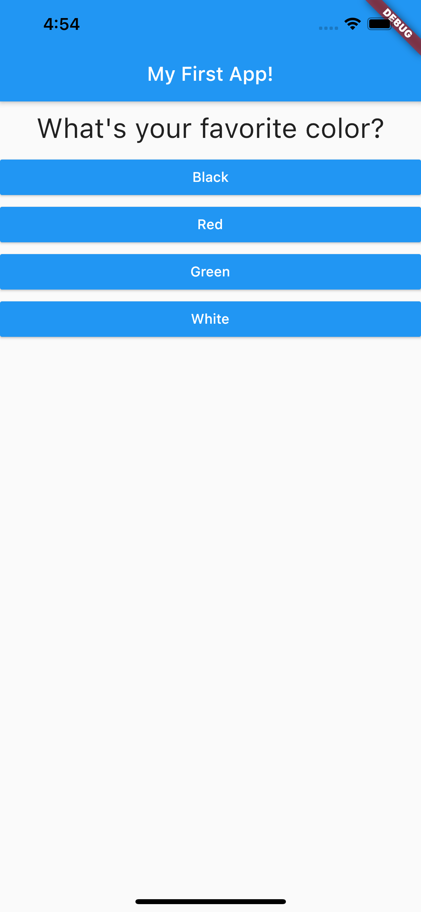

# Flutter-quiz-app
A quiz app build in flutter
Done as part of a speedcoding exercise

## Objectives
To create a quiz app that allows the user to select an answer from a multiple list of options.
Present the final score back to the user

## Images

